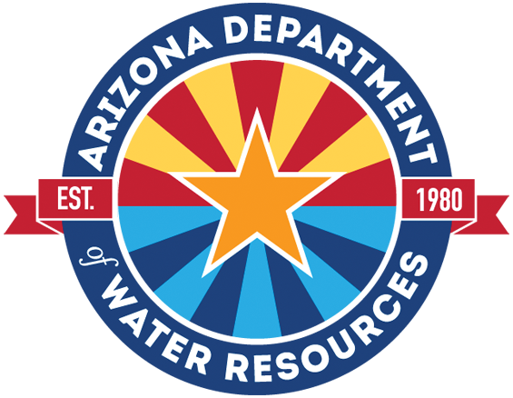

# Improving remote sensing and machine learning-driven groundwater withdrawal estimation in Arizona 
Maintainers: [Sayantan Majumdar](https://www.dri.edu/directory/sayantan-majumdar/) [sayantan.majumdar@dri.edu], [Ryan G. Smith](https://www.engr.colostate.edu/ce/ryan-g-smith/) [ryan.g.smith@colostate.edu]

 &nbsp; 

## Proposal Summary
Groundwater plays a vital role in maintaining global food security and is an essential element of the water budget. However, due to the growing global population, dietary changes, and climate change, there has been a surge in freshwater consumption, and many basins are heavily exploiting their groundwater reserves, which provide almost half of the freshwater supply. As a result, the adverse effects of groundwater overdrafts, such as land subsidence, aquifer depletion, and water pollution, are becoming increasingly apparent worldwide. Despite the urgent need to address these challenges, there is a lack of proactive local-scale monitoring of groundwater withdrawals in most regions, including the United States (US). As the volume of groundwater withdrawn is critical to know in order to implement sustainable solutions, methods for estimating groundwater use at the management scale are needed. 

Existing methods to estimate withdrawals are either expensive and time-consuming or unable to produce reliable predictions at scales needed for local management. Our currently funded grant is developing machine learning approaches that integrate satellite datasets to estimate withdrawals. In this supplement, we propose to extend this funding to enable water managers in Arizona to better understand water budgets. This will provide timely information to local agencies, including the Arizona Department of Water Resources, who have been tasked by Senate Bill 1740 to analyze and prepare a water supply and demand assessment for at least six of the state's groundwater basins every year, with all the basins requiring a supply and demand assessment once every five years. The assessment entails producing estimates of water use in each basin and projections of future water use under various scenarios related to climate, land use, and surface water availability. However, estimating water use in regions without metered datasets poses a challenge that requires significant time and resources from water agencies and still yields high uncertainty. Moreover, conventional estimates of water use only provide "hindcasts," or estimates of past water use, with no ability to project water use into the future.

Arizona is currently in its 28th-year long-term drought, which has depleted surface water reserves from the Colorado River. Consequently, groundwater resources in Southern and South-Central Arizona are under significant stress resulting in land subsidence. Hence, reliable and efficient groundwater pumping monitoring solutions are critical to addressing this region's water security issues.

This work aims to enhance our existing machine learning and remote sensing-based model estimates in Arizona. Current model limitations include uncertainty in the effect of surface water on groundwater use and irrigation efficiency. Further, while our model is capable of making forecasts, extensive data pre-processing is required to produce forecasts. This research will provide us with the necessary resources to develop a robust model that provides actionable withdrawal estimates in light of ongoing and future reductions in the Colorado River and other surface water bodies.

## Getting Started

[Installing the correct environment and running the project](azhydro/README.md)

## Data Pipeline

The project builds a spatially explicit, multi-decadal (1896–2099) dataset for Arizona by combining satellite-derived products, climate model projections, soil properties, streamflow observations, and USBR modeled streamflow. The pipeline is orchestrated by [`azhydro/azhydro.py`](azhydro/azhydro.py) and consists of two main components.

### 1. Google Earth Engine (GEE) Data Download

The [`download_gee_data()`](azhydro/hydrolibs/dataops.py) function downloads 14 bands of geospatial data from GEE as tiled GeoTIFFs at 2 km resolution over Arizona. Data are harmonized across three temporal eras using overlap-period bias-correction ratios to ensure continuity.

#### Bands

| Band | Description | Units | Source |
|------|-------------|-------|--------|
| `annual_et_ensemble_mm` | Actual evapotranspiration | mm/yr | Reitz (1896–1999), OpenET (2000–2025), MACA ensemble (2026–2099) |
| `annual_eto_mm` | Reference evapotranspiration (Penman-Monteith) | mm/yr | PRISM Hargreaves (1896–1978), gridMET (1979–2025), MACA ensemble (2026–2099) |
| `annual_precip_mm` | Precipitation | mm/yr | PRISM (1896–2025), MACA ensemble (2026–2099) |
| `annual_peff_mm` | Effective precipitation (USDA SCS method) | mm/yr | Computed from harmonized ETo, precipitation, and soil AWC |
| `annual_peff_pcml_mm` | Effective precipitation (PCML obs-based, 2000–2024) | mm/yr | PCML model, climatological mean outside 2000–2024 |
| `annual_tmmx_K` | Annual mean daily max temperature | K | PRISM (1896–2025), MACA (2026–2099) |
| `annual_tmmn_K` | Annual mean daily min temperature | K | PRISM (1896–2025), MACA (2026–2099) |
| `lulc` | Land use/land cover (1=Agriculture, 2=Urban, 3=Surface Water) | categorical | USGS historical (≤1984), NLCD (1985–2025), USGS projections (2026–2099) |
| `annual_crop_fraction` | Cropland fraction | fraction | Derived from LULC |
| `annual_irr_fraction` | Irrigated area fraction | binary | IrrMapper RF v1.2 (1985–2025), LULC-derived outside |
| `annual_gw_fraction` | Groundwater irrigation fraction | fraction | USGS snapshots (2000, 2005, 2010, 2015) |
| `soil_depth_cm` | Soil depth | cm | CSRL (static) |
| `awc_in` | Available water capacity (0–152 cm) | inches | SSURGO (static) |
| `ksat_mean_micromps` | Saturated hydraulic conductivity | μm/s | CSRL (static) |

#### Data Harmonization

The pipeline stitches disparate sources into a consistent 1896–2099 time series:

- **ET**: Reitz ensemble (1896–1999) → OpenET v2.0/v2.1 (2000–2025) → MACA × EToF crop coefficients (2026–2099)
- **ETo**: PRISM Hargreaves (1896–1978) → gridMET (1979–2025) → MACA 20-model ensemble (2026–2099)
- **LULC**: USGS historical scenario (≤1984) → NLCD (1985–2025) → USGS 4-scenario mode ensemble (2026–2099)
- **Climate projections**: MACA v2 daily data across 20 GCMs × 2 RCPs (RCP 4.5, RCP 8.5) = 40-member ensemble. All MACA queries use a flat-pipeline approach (single filter + reduce) to keep GEE computation graphs small: ETo uses `.sum().divide(40)` per month (computed per-image to preserve nonlinearity), precip uses `.sum().divide(40)`, and temperature uses `.mean()`.

Per-pixel, per-month bias-correction ratios are computed from overlapping observation periods and applied to extend each variable seamlessly. See [`gee/README.md`](gee/README.md) for asset export details and equations.

#### GEE Pre-Exported Assets

Nine custom ImageCollections are pre-computed via scripts in [`gee/`](gee/) and stored in GEE under `projects/azhydro/assets/`:

| Asset | Description | Years |
|-------|-------------|-------|
| `gridmet_hargreaves_eto_ratio` | gridMET / PRISM Hargreaves monthly ratio (12 images) | Climatology |
| `openet_reitz_et_ratio` | OpenET / Reitz ensemble monthly ratio (12 images) | Climatology |
| `monthly_etof` | Crop coefficient (OpenET / gridMET ETo) | Climatology |
| `prism_hargreaves_eto` | PRISM-based Hargreaves ETo | 1896–1978 |
| `usgs_adjusted_et` | Bias-adjusted Reitz actual ET | 1896–1999 |
| `maca_monthly_eto_v2` | MACA per-model/scenario projected ETo | 2026–2099 |
| `maca_monthly_et_v2` | MACA ensemble projected actual ET | 2026–2099 |
| `lulc_projection_ensemble` | USGS 4-scenario LULC mode | 2026–2099 |
| `monthly_peff_v2` | USDA SCS effective precipitation | 1896–2099 |

#### Download Architecture

Data are downloaded as tiles using a Dask-parallelized worker pool (40 workers, 1 GB each). Each tile covers an 80 km × 80 km region at 2 km resolution. Tiles are later mosaicked and reprojected for the ML pipeline.

### 2. Streamflow Analysis

The [`streamflowops`](azhydro/hydrolibs/streamflowops.py) module handles streamflow data acquisition and rasterization. It covers all 16 Arizona surface watersheds from 1896 to 2099.

#### Data Sources

- **USGS NWIS**: Daily mean discharge (parameter 00060) via the `dataretrieval` Python API, resampled to monthly means
- **USBR CMIP Ensemble**: Monthly modeled streamflow averaged across ~112 climate model runs (scenarios a1b, a2, b1), spanning 1950–2099
- **Historical Ratio Method**: For sites without USBR projections, per-calendar-month scaling ratios are computed against the nearest USBR-gauged reference site and applied to generate synthetic 1950–2099 projections

#### Gauge Network (20 sites)

| USGS ID | USBR ID | Site Name | Watershed |
|---------|---------|-----------|-----------|
| 09380000 | 00013 | Colorado River at Lees Ferry | Colorado River |
| 09429490 | 00014 | Colorado River above Imperial Dam | Colorado River |
| 09444500 | 00058 | San Francisco River at Clifton | Upper Gila River |
| 09448500 | 00059 | Gila River at Head of Safford Valley nr Solomon | Upper Gila River |
| 09497500 | 00061 | Salt River near Chrysotile | Salt River |
| 09498500 | 00062 | Salt River near Roosevelt | Salt River |
| 09499000 | 00063 | Tonto Creek Abv Gun Creek nr Roosevelt | Salt River |
| 09510000 | 00064 | Verde River below Bartlett Dam | Verde River |
| 09508500 | 00064 | Verde R blw Tangle Creek Abv Horseshoe Dam | Verde River |
| 09402300 | — | Little Colorado River Abv Mouth nr Desert View | Little Colorado River |
| 09426620 | — | Bill Williams River near Parker | Bill Williams River |
| 09512500 | — | Agua Fria River near Mayer | Agua Fria River |
| 09415000 | — | Virgin River at Littlefield | Virgin River |
| 09489000 | — | Santa Cruz River near Laveen | Santa Cruz River |
| 09471000 | — | San Pedro River at Charleston | San Pedro River |
| 09520500 | — | Lower Gila River near Dome | Lower Gila River |
| 09535300 | — | Vamori Wash at Kom Vo | San Simon River |
| 09537500 | — | Whitewater Draw near Douglas | White Water Draw |
| 09537200 | — | Leslie Creek near McNeal | White Water Draw / Rio Yaqui |
| 09426650 | — | CAP Canal at Havasu Pumping Plant | CAP Diversion |

Sites with USBR IDs (9 sites) have direct modeled projections. The remaining 11 sites use the historical ratio method, where monthly scaling ratios are computed from the overlapping USGS observation period between the target site and its nearest USBR-gauged reference.

#### Gap-Filling Strategy

1. **USGS observations** take priority within their available record
2. **USBR ensemble mean** (or ratio-scaled synthetic) fills months outside the USGS range
3. **Monthly climatology** (mean of each calendar month from all available data) fills any remaining gaps in the 1896–2099 range

#### Streamflow Raster Creation

[`create_streamflow_rasters()`](azhydro/hydrolibs/streamflowops.py) generates annual GeoTIFF rasters at 2 km resolution (1896–2099) where each pixel receives area-normalized annual streamflow (mm/yr) of its surface watershed:

1. **Watershed rasterization**: [`Surface_Watershed.geojson`](Data/Inputs/GW_Data/Surface_Watershed.geojson) (16 polygons) is rasterized by `OBJECTID`. Each pixel is assigned the area-normalized average annual streamflow of all gauges within its watershed.
2. **Area normalization**: Gauge-averaged discharge (m³/s) is converted to mm/yr by dividing by the watershed area (m²): `mm/yr = Q(m³/s) × 86400 × 365.25 / A(m²) × 1000`. This yields units consistent with the other predictor bands (ET, ETo, precipitation, effective precipitation).
3. **CAP overlay**: Pixels within the [CAP Service Area](Data/Inputs/GW_Data/CAP/CAP_Service_Area.geojson) (Maricopa, Pima, Pinal counties) receive additional Colorado River streamflow from Lees Ferry (09380000) and the CAP Canal at Havasu Pumping Plant (09426650), normalized by the CAP service area. This represents imported water delivered via the Central Arizona Project canal.

The CAP overlay does not double-count local watershed flows. Salt/Verde watershed pixels in the Phoenix AMA correctly receive both their local watershed streamflow (from SRP source gauges) and imported CAP water (from Colorado River gauges), reflecting the dual water supply in those areas.

## Citations
Majumdar, S., Smith, R., Conway, B. D., & Lakshmi, V. (2022). Advancing remote sensing and machine learning‐driven frameworks for groundwater withdrawal estimation in Arizona: Linking land subsidence to groundwater withdrawals. Hydrological Processes, 36(11), e14757. https://doi.org/10.1002/hyp.14757

## Acknowledgments
We would like to acknowledge funding from NASA (Grant numbers: 80NSSC21K0979 and 80NSSC23K1453). We are grateful to all the opensource software and data communities for making their resources publicly available and also thank the ADWR (https://infoshare.azwater.gov/docushare/dsweb/View/Collection-72) for providing the necessary data sets related to groundwater withdrawals, land subsidence, and other shapefiles used in this research. Finally, we would like to convey our gratitude to our colleagues and families for their continuous motivation and support. Any opinions, findings, conclusions, or recommendations expressed in this material are those of the authors and do not necessarily reflect the views of the funding agencies.

 &nbsp;  &nbsp;  &nbsp;  &nbsp;  &nbsp; 
