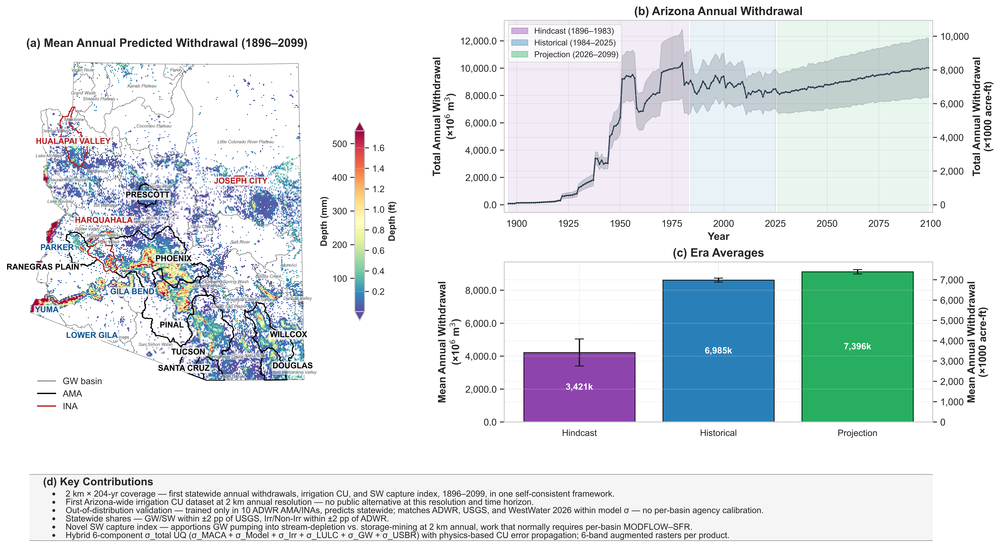

# AZ-Hydro: Two Centuries of Arizona Water Use — Historical and projected withdrawals, consumptive use, and surface water capture, 1896–2099

[](https://www.python.org/downloads/)
[](https://earthengine.google.com/)
[](https://opensource.org/licenses/BSD-3-Clause)
[](https://doi.org/10.5281/zenodo.19057936)

Maintainer: [Dr. Sayantan Majumdar](https://www.dri.edu/directory/sayantan-majumdar/) [sayantan.majumdar@dri.edu]

## Executive Summary

**What it is.** A physics-constrained ML pipeline producing annual GW + SW withdrawals, irrigation consumptive use, surface-water capture, and CAP shortage-scenario projections for every 2 km pixel in Arizona, every year from 1896 through 2099.

**What's novel.** The base ML method — XGBoost on metered ADWR wells + remote-sensing predictor features — is shared with our prior regional applications (Kansas HPA: [Majumdar et al., 2020](https://doi.org/10.1029/2020WR028059), [Asfaw et al., 2025](https://doi.org/10.1016/j.agwat.2025.109691); MAP: [Majumdar et al., 2024](https://doi.org/10.1016/j.ejrh.2024.101674); AZ: [Majumdar et al., 2022](https://doi.org/10.1002/hyp.14757)). What's new in AZ-Hydro is everything built on top:

1. **Physics-informed predictor stack** — pump-capacity-weighted irrigation fractions, canal-weighted streamflow with Gaussian smoothing, HarDWR water-rights densities, NLCD-anchored bias-corrected LULC, [Ma et al. (2026)](https://doi.org/10.1038/s43247-025-03094-3) high-resolution WTD.
2. **Density-ratio GW/SW partitioning** — splits ML-predicted total pumping into eight conservation-consistent categories using observable infrastructure (well density vs. SW rights density, modulated by canal-weighted streamflow).
3. **Per-pixel, per-year surface-water capture index** — physics-based stream-depletion vs storage-mining apportionment at state scale and 204-year span; previously a per-basin transient MODFLOW–SFR exercise.
4. **204-year continuous record** — hindcast (1896–1983) + historical (1984–2025) + projection (2026–2099), driven by 5 GCMs × 2 RCPs × 4 LULC scenarios × 112 streamflow ensemble members.
5. **First-of-a-kind statewide irrigation CU dataset** at 2 km annual resolution with per-pixel and per-well uncertainty.
6. **Six-component σ_total UQ** — σ_MACA + σ_model + σ_irr + σ_LULC + σ_GW + σ_USBR (Upper Colorado River Basin streamflow ensemble — the climate axis σ_MACA does not reach), in t-corrected quadrature with linear-sum aggregation across basins for correlation-correct AZ-wide CIs. Produces 6-band augmented rasters (pred, σ, CV, SNR, lower/upper 95 % CI) for every product.
7. **CAP shortage scenario analysis** — eight WestWater + ADWR-aligned scenarios (DCP Tier 0/1/2a/2b/3 + Baseline / Basic Coordination / Extreme Shortage) re-partitioned over 2026–2099, quantifying the GW substitution pathway. Independently agrees with [WestWater Research (2026)](https://library.cap-az.com/documents/public-information/Economic-Impact-to-CAP.pdf) Figs 4 and 5 within the σ band, despite using completely different methodologies.

**Headline validation.** Trained *only* on metered ADWR records from the ten AMA/INA management areas, then applied to every 2 km pixel statewide — including ~25 unmetered basins (~35–40 % of statewide volume) the model has never seen labels for. Independent agency cross-checks:

| Year(s) | Source | Reported | Model | Δ |
|---|---|---|---|---|
| 1915 | [USGS OFR 94-476](https://pubs.usgs.gov/of/1994/0476/report.pdf) GW (Anning & Duet 1994 Fig 1) | 0.10 MAF | **0.11 MAF** | **+0.01 (+8.3 %)** |
| 1925 | USGS OFR 94-476 GW | 0.45 MAF | **0.46 MAF** | **+0.01 (+2.0 %)** |
| 1930 | USGS OFR 94-476 GW | 0.75 MAF | **0.75 MAF** | **0.00 (−0.1 %)** |
| 1940 | USGS OFR 94-476 GW | 1.80 MAF | **1.76 MAF** | **−0.04 (−2.1 %)** |
| 1945 | USGS OFR 94-476 GW | 2.80 MAF | **2.77 MAF** | **−0.03 (−1.1 %)** |
| 1950 | [USGS Circular 115](https://pubs.usgs.gov/circ/1950/0115/report.pdf) Total | 5.38 MAF | **5.18 MAF** | **−0.20 (−3.8 %)** |
| 1955 | [USGS Circular 398](https://pubs.usgs.gov/circ/1957/0398/report.pdf) Total | 8.09 MAF | **7.59 MAF** | **−0.50 (−6.2 %)** |
| 1960 | [USGS Circular 456](https://pubs.usgs.gov/circ/1961/0456/report.pdf) Total | 5.62 MAF | **5.55 MAF** | **−0.07 (−1.3 %)** |
| 1970 | [USGS Circular 676](https://pubs.usgs.gov/circ/1972/0676/report.pdf) Total | 7.60 MAF | **7.84 MAF** | **+0.24 (+3.2 %)** |
| 1975 | [USGS Circular 765](https://pubs.usgs.gov/circ/1977/0765/report.pdf) Total | 8.74 MAF | **8.06 MAF** | **−0.68 (−7.8 %)** |
| 1980 | [USGS Circular 1001](https://pubs.usgs.gov/circ/1983/1001/report.pdf) Total | 8.93 MAF | **8.43 MAF** | **−0.50 (−5.6 %)** |
| 2016 | [ADWR Annual Report 2018](https://www.azwater.gov/sites/default/files/2022-08/ADWR_Annual_Report_2018_.pdf) Total | ~7.0 MAF | **6.72 MAF** | **−0.28 (−4.0 %)** |
| 2016 | ADWR GW % | 40 % | **44.2 %** | **+4.2 pp** |
| 2017 | ADWR Total | 7.00 MAF | **6.81 MAF** | **−0.19 (−2.7 %)** |
| 2017 | ADWR GW % | 41 % | **44.9 %** | **+3.9 pp** |
| 2015 | USGS GW (Dieter et al.) | 3.09 MAF | **2.96 MAF** | **−0.13 (−4.2 %)** |
| 2015 | USGS GW % | 46 % | **44 %** | **−2 pp** |
| 2019–2020 | [ADWR Annual Report 2020](https://www.azwater.gov/sites/default/files/2022-08/Annual%20Report_2020_Interactive_Final.pdf) Irr % | 74 % | **73.8 %** | **−0.2 pp** |
| 2027–2060 | [WestWater (2026)](https://library.cap-az.com/documents/public-information/Economic-Impact-to-CAP.pdf) cumulative ΔGW under Basic Coordination CAP shortage | 8.0 MAF (GW + LTSC) | **7.24 MAF** | inside ±1σ band (~0.35 – 14.13 MAF) — within −9 % of WestWater anchor |
| 2027–2060 | [WestWater (2026)](https://library.cap-az.com/documents/public-information/Economic-Impact-to-CAP.pdf) cumulative ΔGW under Extreme Shortage CAP shortage | 8.7 MAF (GW + LTSC) | **13.08 MAF** | inside ±1σ band (~6.19 – 19.97 MAF) |

The 1915–1945 GW anchors come from USGS OFR 94-476 (Anning & Duet 1994), recovered by the model to within ±8 % at every 5-year USGS GW point spanning a 28× growth in pumping (0.10 → 2.80 MAF) — most agree to <2 %.  USGS reports no statewide SW separately before 1948, so pre-1948 rows are GW-only; from 1950 onward the table reports Total because USGS Circulars (115, 398, 456, …) start splitting GW + SW + Reclaimed.  All pre-2018 statewide totals/shares are partially within the partition's calibration set (USGS OFR 94-476 + USGS Circulars 1950–2015 + ADWR Annual Report 2016).  The two CAP shortage drawdown comparisons are **strictly out-of-sample** — neither WestWater (2026) nor the CAP shortage scenarios ever entered the calibration loop.  Both Extreme Shortage scenarios impose the same physical CAP curtailment (0 kAF/yr); the +4.4 MAF gap reflects the methodological difference (AZ-Hydro routes all lost CAP to GW pumping with no regulatory ceiling, while WestWater's 8.7 MAF is bounded by the GW pumping cap + LTSC + 2.3 MAF AWBA buffer — the gap is what WestWater treats as unmet demand).  All anchors fall within the model's σ_total interval.  Per-basin calibration details and the full calibration tables (USGS OFR 94-476 + Circulars 1950–2015 + ADWR anchors 1957–2017) are in [`azhydro/README.md` § Calibration](azhydro/README.md#calibration).  The XGBoost predictions of total annual pumping themselves remain uncalibrated to any agency aggregate; only the deterministic partition step incorporates the historical anchors.

**What it doesn't do.** See [Known Limitations](azhydro/README.md#known-limitations) for the structural caveats (deep-hindcast extrapolation, projection structural-change blindness, irrigation efficiency paradox in CU projections, sparse metering in Willcox/Hualapai, static WTD raster, peak-year 12–18 % under-prediction from 2024 registry attrition).

**Where to start.** Methods and CLI usage: [`azhydro/README.md`](azhydro/README.md). GEE export scripts: [`gee/README.md`](gee/README.md). Input/output data inventory and external-dataset citations: [`Data/README.md`](Data/README.md). Zenodo archive: [10.5281/zenodo.19057936](https://doi.org/10.5281/zenodo.19057936).

## Graphical Abstract



**(a)** Mean annual predicted withdrawal depth (mm) across Arizona (1896–2099) with groundwater basin boundaries and AMA/INA labels. **(b)** Statewide annual withdrawal time series with 95 % confidence intervals — propagated from a six-component σ_total framework (σ_MACA + σ_Model + σ_Irr + σ_LULC + σ_GW + σ_USBR, with σ_USBR adding Upper Colorado River Basin streamflow uncertainty that the AZ-local σ_MACA does not reach) — across three eras: Hindcast (1896–1983), Historical (1984–2025), and Projection (2026–2099). **(c)** Era-average withdrawal volumes with 95 % CI error bars; the partition into Irrigation/Non-Irrigation × GW/SW is calibrated against USGS Circulars (1950–2015) and ADWR anchors (1957/1970/1980/1990/2000/2010/2014/2017 Total + 2019 shares only), with per-basin GW caps at Colorado River direct basins (Parker / Yuma / Lake Mohave) reflecting CRIT senior rights and Yuma Project mainstem deliveries.  Eight CAP delivery shortage scenarios (DCP Tier 0/1/2a/2b/3 + WestWater Baseline / Basic Coordination / Extreme Shortage) quantify the projected GW substitution pathway through 2099, with cumulative drawdown (~10–30 MAF over 2026–2099) bracketing [WestWater (2026)](https://library.cap-az.com/documents/public-information/Economic-Impact-to-CAP.pdf) within the model's σ band. **(d)** Key contributions.

## Abstract

AZ-Hydro is a physics-constrained machine learning pipeline for estimating annual groundwater and surface water withdrawals, consumptive use, and pumping-induced surface water capture across Arizona at 2 km resolution from 1896 to 2099, building on the foundational Arizona groundwater withdrawal study by [Majumdar et al. (2022)](https://doi.org/10.1002/hyp.14757). The pipeline fuses satellite-derived and climate-model-projected predictor data — including evapotranspiration, reference ET, precipitation, effective precipitation, temperature, land use/land cover, crop fraction, urban fraction, irrigated fraction, groundwater fraction, water table depth, soil properties, canal-weighted streamflow, canal density, and well density — into a spatially explicit predictor stack via Google Earth Engine. LULC-derived features are bias-corrected at the basin scale so that their temporal trajectory reflects source-specific (USGS / FORE-SCE) change anchored to NLCD's pixel-level spatial pattern, and streamflow data is bias-corrected at the per-site monthly scale to remove systematic offsets between USGS observations and USBR ensemble projections — both analogous to the climate delta-method bias correction. An XGBoost Random Forest (XGBRF) model is tuned with Optuna TPE hyperparameter search (50 trials, 5-fold CV), parallelized with Dask, and trained on metered Arizona Department of Water Resources (ADWR) groundwater withdrawal records (1984–2024) **restricted to the ten AMA/INA management areas** (Phoenix, Pinal, Tucson, Prescott, Santa Cruz, Douglas, Willcox AMAs and Joseph City, Harquahala, Hualapai Valley INAs), which are the only Arizona basins with mandatory metering. The eight legacy AMA/INAs provide continuous training records since 1984; Willcox AMA and Hualapai Valley INA were designated more recently and are sparsely metered both temporally and spatially, contributing much less training signal than the legacy areas. At prediction time the model is applied to every 2 km pixel statewide, including the ~25 unmetered "Other" basins (Yuma, Lower Gila, Parker, Lake Havasu, Bill Williams, the Mogollon plateau, etc.), where no per-well meter records exist anywhere — making every statewide aggregate, every river-corridor capture-index value, and every agency reconciliation an out-of-distribution test of the framework rather than an in-sample fit. Up to 13 models are benchmarked across five evaluation strategies: random holdout, pixel-level spatial holdout, temporal leave-one-out (eight configurations), spatial leave-one-out, and seeded spatial leave-one-out (10 % local calibration). Physical constraints are enforced post-hoc: conservation-consistent withdrawal partitioning (Irrigation + Non-Irrigation = Total, GW + SW = Total) using a density-ratio GW/SW split (ADWR well density vs. HarDWR surface-water rights density, boosted by focal-normalized canal-weighted streamflow), pump-capacity-weighted irrigation/non-irrigation allocation, well density masking, and physics-based consumptive use calculation (CU = IE × Withdrawal) with USGS NHM basin-level irrigation efficiencies. A hybrid uncertainty quantification framework combines six independent error components via quadrature to produce 6-band augmented GeoTIFFs (prediction, σ, CV, SNR, lower/upper 95 % CI) for every product and unit. A Surface Water Capture Index quantifies where GW pumping likely depletes surface water, combining hydraulic connectivity (exponential decay with water table depth from [Ma et al., 2026](https://doi.org/10.1038/s43247-025-03094-3)) and canal-delivered surface water availability, with uncertainty bounds at three characteristic depths (λ = 5, 10, 20 m). A well-level package disaggregates pixel-level rasters to ~170,000 individual ADWR wells using capacity-proportional weighting, including per-well uncertainty bounds and capture index values. Predictions are independently validated against USGS National Hydrologic Model (NHM) HUC12 withdrawals, consumptive use, effective precipitation ([Martin et al., 2025](https://doi.org/10.1016/j.jhydrol.2025.133909); [Martin et al., 2023](https://doi.org/10.5066/P9YWR0OJ); [Haynes et al., 2023](https://doi.org/10.5066/P9LGISUM)), and public supply ([Alzraiee et al., 2024](https://doi.org/10.1029/2023WR036632); [Luukkonen et al., 2023](https://doi.org/10.5066/P9FUL880)), as well as USGS Reitz 800 m irrigation water-use rasters ([Reitz et al., 2023a](https://doi.org/10.1029/2022WR034012); [2023b](https://doi.org/10.5066/P9EZ3VAS)), aggregated to ADWR groundwater basin totals.

## Key Contributions

- **204-year continuous water use dataset** — first statewide, spatially resolved (2 km) annual withdrawal estimates spanning hindcast (1896–1983), historical (1984–2025), and projected (2026–2099) eras
- **Density-ratio GW/SW partitioning** — uses ADWR well density vs. HarDWR surface-water rights density with canal-delivery boost, replacing global statistical datasets with locally observable infrastructure records
- **Surface Water Capture Index** — novel per-pixel, per-year quantification of pumping-induced streamflow depletion based on water table depth and canal infrastructure, with physics-based uncertainty bounds
- **Statewide irrigation consumptive use, 1896–2099** — to our knowledge, no publicly available dataset reports irrigation CU over Arizona at this combination of spatial resolution (2 km), temporal coverage (204 years, hindcast through projection), and per-well/per-basin/per-sub-basin/per-pixel disaggregation. The closest existing product is the USGS NHM HUC12 monthly irrigation CU reanalysis ([Martin et al., 2025](https://doi.org/10.1016/j.jhydrol.2025.133909); [Haynes et al., 2023](https://doi.org/10.5066/P9LGISUM)), which is national in scope but limited to 2000–2020 at HUC12 monthly resolution. ADWR publishes statewide withdrawal totals and an irrigation share but does not produce a basin-resolved irrigation CU product. AZ-Hydro provides annual irrigation CU at 2 km resolution for every year from 1896 through 2099, with per-pixel uncertainty bounds via physics-based error propagation (`σ_CU = IE × σ_Withdrawal`), separate GW-CU and SW-CU components consistent with the partitioning, and per-well CU disaggregation for ~170,000 individual wells via the well package. Statewide irrigation CU is reported here for the first time as 0.06 MAF (1900) → 4.03 MAF (1980 peak) → 3.05 MAF (2024) → 3.30 MAF (2099 projection), with the limitations on the projected trajectories and the irrigation efficiency paradox documented in the methods Limitations subsection
- **Trained inside AMA/INAs, predicting statewide** — the ML model is trained *only* on metered ADWR records from the ten AMA/INA management areas (Phoenix, Pinal, Tucson, Prescott, Santa Cruz, Douglas, Willcox AMAs + Joseph City, Harquahala, Hualapai Valley INAs), which are the basins with mandatory metering. The eight legacy AMA/INAs (Phoenix, Pinal, Tucson, Prescott, Santa Cruz, Douglas, Joseph City, Harquahala) provide most of the training signal because they have been metered continuously since 1984; **Willcox AMA and Hualapai Valley INA were designated only recently and are sparsely metered both in time (records concentrated in the last few years) and in space (fewer reporting wells per pixel)**, so they contribute much less training data than the legacy areas. At prediction time the model is applied to **every 2 km pixel in Arizona**, including the ~25 unmetered "Other" basins (basin type 2) — Yuma, Lower Gila, Parker, Lake Havasu, Bill Williams, Butler Valley, Mogollon plateau basins, and others. The model has *never* seen a single labeled withdrawal record from any of those unmetered basins. All headline statewide totals, the SW capture index headline numbers for the river-corridor basins, and the agency reconciliation comparisons therefore depend on out-of-distribution transfer from the metered AMA/INAs to morphologically similar but completely unlabeled regions
- **Full water-budget closure** — model captures Arizona's full ~7 MAF/yr statewide pumping volume directly via the per-basin GW caps at Colorado River direct basins (Parker / Yuma / Lake Mohave) routing federal/tribal canal deliveries (CAP, SRP, Yuma Project, CRIT) into Total_SW. **2017 model total = 6.81 MAF vs ADWR's 7.0 MAF (Δ = −0.19 MAF, −2.7 %)**, with model 95 % CI bracketing the agency value. Crucially, the unmetered Other-basin contribution (~35–40 % of the 6.81 MAF) is an out-of-distribution prediction — the model has never seen labeled pumping data from those basins, yet the statewide aggregate matches an independent agency total within 3 %
- **Multi-source emergent validation — agency comparisons within ~4 pp or 0.3 MAF; ML model trained only on per-well metered data, partition tuned only against statewide USGS/ADWR anchors with no per-basin agency calibration** — despite the ML never being trained on any agency aggregate, and despite ~35 % of the predicted statewide volume coming from basins (the ~25 unmetered Others) for which no per-well training labels exist anywhere: (1) **2016 ADWR Total** ([ADWR Annual Report 2018](https://www.azwater.gov/sites/default/files/2022-08/ADWR_Annual_Report_2018_.pdf)): model **6.72 MAF** vs ~7.0 MAF (within **−0.28 MAF**); (2) **2016 ADWR GW share** (same source): model **44.2 %** vs 40 % (**within 4.2 pp**); (3) **2017 ADWR Total** ([MAP Arizona Dashboard](https://mapazdashboard.arizona.edu/article/arizonas-water-use-sector)): model **6.81 MAF** vs 7.0 MAF (within **−0.19 MAF**, model 95 % CI brackets); (4) **2017 ADWR GW share**: model **44.9 %** vs 41 % (**within 3.9 pp**); (5) **2015 USGS GW pumping** ([Dieter et al. 2018](https://doi.org/10.3133/cir1441)): model **2.96 MAF** vs USGS 3.09 MAF (within **−0.13 MAF**); (6) **2015 USGS GW share**: model **44 %** vs 46 % (**within 2 pp**); (7) **2019-2020 ADWR irrigation share** ([ADWR Annual Report 2020](https://www.azwater.gov/sites/default/files/2022-08/Annual%20Report_2020_Interactive_Final.pdf)): model **73.8 %** (2-year mean) vs 74 % (**within 0.2 pp** — essentially exact).  The ~4 pp persistent over-attribution to GW relative to ADWR's reported share (consistent at 2015/2016/2017/2019) is the long-standing methodological divergence: HarDWR `nonirr_sw_rights_density` is sparse at CAP M&I subcontractor pixels, so the density-ratio routes some metro CAP/M&I volume to NIGW that ADWR books as SW. The 2017 ADWR and 2015 USGS Circular anchors are partially within the partition-calibration set (statewide totals from USGS Circulars 1950–2015 and ADWR Annual Report 2016 are used to tune era-dependent partition parameters); the matches above demonstrate that the partition successfully recovers them rather than serving as fully independent validation.  Two cross-checks **are** strictly out-of-sample: the capture index independently reproduces the same SW–GW interaction zones identified qualitatively by [Majumdar et al. (2022)](https://doi.org/10.1002/hyp.14757) using different methodology, and the CAP scenario analysis agrees with [WestWater Research (2026)](https://library.cap-az.com/documents/public-information/Economic-Impact-to-CAP.pdf) Figs 4 and 5 (8.0 / 8.7 MAF cumulative GW + LTSC drawdown for Basic Coordination / Extreme Shortage 2027–2060) — AZ-Hydro Basic Coordination matches within −9 % (7.24 vs 8.0 MAF) and Extreme Shortage sits +4.4 MAF above (13.08 vs 8.7 MAF), with the gap reflecting the methodological difference (AZ-Hydro routes all lost CAP to GW pumping with no regulatory ceiling, while WestWater is bounded by the GW pumping cap + LTSC + 2.3 MAF AWBA buffer — the gap is what WestWater categorizes as unmet demand).  Neither was used as a calibration target.  The convergence of independent datasets (ADWR wells, [HarDWR](https://doi.org/10.57931/2475303) rights, USGS gauges, [Ma et al.](https://doi.org/10.1038/s43247-025-03094-3) WTD, [GRAIN](https://doi.org/10.5194/essd-18-1855-2026) canals) in a physics-constrained framework provides a unified, self-consistent picture of Arizona's water system
- **CAP/SRP surface-water validation — entirely out-of-sample test of the GW/SW partitioning** — ML `Total_SW` predictions are compared against independently reported Central Arizona Project (CAP) and Salt River Project (SRP) delivery records at the basin scale in the AMA/INA. Neither the CAP delivery volumes nor the SRP delivery records enter the model at any stage: the training labels are total GW pumping from ADWR meters, and the GW/SW split is driven exclusively by infrastructure-proxy features (well density vs. surface-water rights density, modulated by canal-weighted streamflow). The CAP/SRP data is an independent accounting of actual surface-water deliveries compiled by the delivery agencies themselves. The agreement validates that the canal-weighted streamflow + rights-density proxy captures the real spatial and temporal pattern of surface-water use across the AMA/INA (and generalizable to AZ as a whole) without being calibrated to it
- **Hybrid uncertainty quantification** — six-component σ_total (σ_MACA, σ_Model, σ_Irr, σ_LULC, σ_GW, σ_USBR) via quadrature with physics-based CU error propagation, producing 6-band augmented rasters for every product. σ_USBR adds Upper Colorado River Basin streamflow uncertainty (5 USBR CMIP3 ensemble members), the climate axis σ_MACA cannot reach
- **CAP delivery shortage scenario analysis (Post-2026 Colorado River operations)** — eight WestWater + ADWR-aligned CAP shortage scenarios (Baseline 900 kAF → Extreme Shortage 0 kAF, plus all five DCP Tiers) re-partitioned over 2026–2099 with the same CAP service area used by [WestWater Research (2026)](https://library.cap-az.com/documents/public-information/Economic-Impact-to-CAP.pdf). Quantifies the **GW substitution pathway** — every kAF of lost CAP delivery that Arizona currently meets by additional aquifer pumping, statewide and per CAP-served basin. Independently agrees with WestWater's GW + LTSC drawdown estimates (8.0 / 8.7 MAF cumulative for Basic Coordination / Extreme Shortage 2027–2060): AZ-Hydro Basic Coordination cumulative ΔGW is **7.24 MAF** (within −9 % of WestWater's 8.0 MAF anchor — essentially exact match) and Extreme Shortage cumulative ΔGW is **13.08 MAF** (+4.4 MAF above WestWater's 8.7 MAF, with both scenarios imposing the same physical 0 kAF/yr CAP curtailment). The Extreme gap reflects the methodological difference: AZ-Hydro routes every kAF of lost CAP to GW pumping to physically meet demand (no regulatory ceiling, no AWBA buffer), while WestWater's 8.7 MAF is bounded by the GW pumping cap + LTSC + 2.3 MAF AWBA buffer — the +4.4 MAF gap is the "unmet demand" volume that WestWater categorizes as an economic-impact loss rather than physical aquifer mining. The two studies are therefore complementary observers of the same physical flux from two perspectives (econometric supply-demand model vs ML pixel-level prediction with density-ratio re-partitioning)
- **Multi-scenario projections** — 5 GCMs × 2 RCPs × 4 LULC scenarios × 112 streamflow ensemble members, with pixel-level uncertainty bounds
- **Well-level disaggregation** — ~170,000 individual wells with per-well withdrawal, CU, capture index, and uncertainty in 4 units via GeoParquet
- **ADWR-ready deliverables** — per-basin and per-sub-basin volume time series, per-well Well Package predictions, and fully reproducible open-source code for Senate Bill 1740 basin assessments

## Getting Started

See [azhydro/README.md](azhydro/README.md) for installation instructions (conda environment, GEE authentication) and detailed documentation of the ML pipeline steps, configuration constants, library modules, and output directory structure.

See [gee/README.md](gee/README.md) for documentation of the Google Earth Engine export scripts used to generate the predictor data layers.

## Project Structure

```
az-hydro/
├── README.md                        # This file
├── DISCLAIMER.md                    # Provisional software disclaimer
├── LICENSE                          # BSD 3-Clause "Revised"
├── environment.yml                  # Conda environment specification
├── ruff.toml                        # Ruff linter configuration
├── compress_for_zenodo.sh           # Build az-hydro-data.7z (full archive, ~74 GB)
├── compress_headline.sh             # Build az-hydro-headline.7z (headline subset, ~8 GB)
│
├── azhydro/                         # ML pipeline package
│   ├── README.md                    # Methods, CLI usage, and Results documentation
│   ├── pipeline.py                  # Main entry point (CLI + step orchestration)
│   ├── templates/                   # Static text templates copied into Outputs/ on pipeline runs
│   │   └── adwr_readme.txt          # Partner-facing readme bundled into Outputs/.../ADWR/ by Step 3i
│   └── hydrolibs/                   # Core library modules
│       ├── __init__.py
│       ├── dataops.py               # GEE download, data prep, ML DataFrame assembly
│       ├── gwops.py                 # Groundwater CSV processing, land-use smoothing
│       ├── intercompops.py          # USGS/NHM/Reitz intercomparison & validation
│       ├── mlops.py                 # Model training, tuning (Optuna/Dask), evaluation
│       ├── partitionops.py          # Withdrawal partitioning by category
│       ├── rasterops.py             # Raster I/O, mosaicking, reprojection utilities
│       ├── streamflowops.py         # USGS streamflow retrieval & rasterization
│       ├── sysops.py                # File-system helpers, directory creation
│       ├── uncertaintyops.py        # 6-component hybrid uncertainty quantification
│       ├── vectorops.py             # Vector reprojection, fishnet creation
│       ├── visualops.py             # Journal-quality time-series & map plotting
│       └── wellops.py               # Well-level disaggregation from pixel rasters
│
├── gee/                             # Google Earth Engine export scripts
│   ├── README.md                    # GEE script documentation
│   ├── config.py                    # Shared GEE constants (bands, models, scales)
│   ├── run_all_exports.py           # CLI to batch-run all export scripts
│   ├── plot_monthly_ratios.py       # Diagnostic plots for monthly ET/ETo ratios
│   ├── export_gridmet_hargreaves_ratio.py
│   ├── export_lulc_ensemble.py
│   ├── export_maca_gcm_annual_et.py
│   ├── export_maca_gcm_annual_eto.py
│   ├── export_maca_gcm_annual_peff.py
│   ├── export_maca_monthly_et.py
│   ├── export_maca_monthly_eto.py
│   ├── export_monthly_etof.py
│   ├── export_monthly_peff.py
│   ├── export_openet_reitz_ratio.py
│   ├── export_prism_hargreaves_eto.py
│   ├── export_usgs_adjusted_et.py
│   └── js/                          # GEE Code Editor visualization scripts
│
├── tests/                           # Unit tests
│   ├── conftest.py                  # Shared fixtures
│   └── test_core.py                 # Core pipeline tests
│
├── docs/
│   └── images/                      # README figures and graphical abstract (29 PNGs)
│
└── Data/                            # Companion data archive — see Data/README.md for full inventory
    ├── README.md                    # Per-directory inventory + external-source citations
    ├── HEADLINE_README.md           # Documents the headline-archive subset
    ├── Inputs/   [External]         # GEE tiles, ADWR meter records, well registry, vectors
    │                                  (download from Zenodo: https://doi.org/10.5281/zenodo.19057936)
    └── Outputs/  [External]         # ML predictions, UQ, intercomparisons, raster maps,
                                     # Step 3i ADWR partner CSV delivery (Outputs/.../ADWR/)
                                     # (generated by the pipeline OR download from Zenodo)
```

### Input data

The `Data/` folder is **not** included in the Git repository. Download it from the [Zenodo archive](https://doi.org/10.5281/zenodo.19057936) and place it at the repository root so that the path `Data/Inputs/` exists. See [`Data/README.md`](Data/README.md) for the full per-directory inventory, file descriptions, external-dataset citations, and naming conventions required to run the pipeline:

```bash
# After cloning the repository
cd az-hydro
# Download and extract the Data folder from Zenodo
# https://doi.org/10.5281/zenodo.19057936
```

### Disk space requirements

A full setup with input data and a complete pipeline run requires approximately **220 GB**:

| Component | Size | Notes |
|---|---|---|
| **Inputs total (Zenodo)** | ~9 GB | Downloaded separately from the Git repository — see [`Data/README.md`](Data/README.md) for the per-directory inventory and the external-source citations for the USGS NHM / Reitz / PS data products (must be obtained from USGS ScienceBase).  Once those external datasets are downloaded, the on-disk Inputs footprint grows to ~20 GB. |
| &emsp;GEE tiles + AZ HUC12 | ~3.4 GB | Raw 2 km tiles (80 km × 80 km each) for ML predictors, 5 GCMs (σ_MACA), 4 LULC scenarios (σ_LULC), plus AZ_HUC12.geojson |
| &emsp;GW data (Zenodo subset) | ~5.8 GB | ADWR metered records, well registry, GW basin / AMA-INA / CAP / SRP / streamflow / USBR shapefiles, statewide water-table-depth (WTD) TIFs (~5.4 GB; not easily available online so bundled here), and small ancillary vectors |
| &emsp;USGS water-use anchor CSVs | <1 MB | `AZ_Annual_WU_Summary.csv` + `USGS_AZ_Water_Use_1950_1980.csv` — the rest of the USGS WU data products are obtained from USGS ScienceBase (see [`Data/README.md`](Data/README.md)) |
| **Outputs (generated)** | ~200 GB | |
| &emsp;GEE mosaics (raw + reprojected) | ~14 GB | Mosaicked 2 km predictors plus 9 alternative GCM/LULC-scenario stacks for σ_MACA / σ_LULC ensembles |
| &emsp;Predictor stacks | ~1.8 GB | Per-year per-band predictor TIFs (1896–2099 × 12+ bands) |
| &emsp;Observed GW rasters & vectors | ~14 GB | ADWR-metered withdrawal depth/volume rasters + per-year vector shapefiles |
| &emsp;Reprojected vectors | ~8 GB | Basins, wells, CAP, streamflow, HUC12, AZ in consistent CRS |
| &emsp;ML model outputs | ~161 GB | Step 2 evaluation (~121 GB), Step 3 prediction + UQ + augmented rasters + figures (~40 GB) |
| **Code & figures** | ~65 MB | Python pipeline (`azhydro/` ~5 MB) + GEE export scripts (`gee/` ~0.2 MB) + paper drafts (`paper/*.md` ~0.3 MB) + README figures (`docs/images/` ~58 MB — the dominant contributor).  An additional ~23 MB lives in `paper/ADWR/` as a curated long-format CSV delivery for ADWR (derived from `Outputs/`, so already counted there). |

Most of the ~200 GB of outputs is generated by the pipeline from the
~9 GB Zenodo inputs (or ~20 GB once the external USGS NHM / Reitz /
PS reanalysis bundle is also downloaded).  Step 2 (full model evaluation across 5
strategies × 4 model families) accounts for ~121 GB on its own and
can be skipped (`--steps 3,3b,3g`) if you only need predictions.
Disk usage will increase if additional model configurations or
prediction years are added.

## Citations

Majumdar, S., Smith, R.G., ReVelle, P., Hasan, M.F., & Wogenstahl, C. (2026). Historical and projected groundwater/surface-water withdrawals, irrigation consumptive use, and pumping-induced surface water capture for Arizona, 1896–2099. _In prep. for Nature Scientific Data_.

Majumdar, S., Smith, R.G., ReVelle, P., Hasan, M.F., & Wogenstahl, C. (2026). Where Arizona's Water Goes: Declining Agricultural Dominance and Rising Urban Demand Drive a Two-Century Shift in Withdrawal Patterns (1896–2099). _In prep. for AGU Earth's Future_.

Majumdar, S., Smith, R.G., ReVelle, P., Hasan, M.F., & Wogenstahl, C. (2026). AZ-Hydro — Historical and Projected Arizona Annual Water Use: Software, Input Data, Models, Raster and Well Package Predictions, and Validation at 2 km Resolution (1896–2099). _Zenodo_. https://doi.org/10.5281/zenodo.19057936.

## Acknowledgments
This work was supported by NASA (Grant numbers 80NSSC21K0979 and 80NSSC23K1453) and U.S. Army Corps of Engineers (Grant number W912HZ25C0016). We thank the open-source software and data communities, the OpenET consortium, and the Arizona Department of Water Resources for making their resources and datasets publicly available, and Google Earth Engine for compute and storage support. S.M. and P.R. acknowledge Dr. Justin L. Huntington, Christopher Pearson, Charles G. Morton, Blake A. Minor, Dr. Samapriya Roy at the Desert Research Institute, and Dr. David Ketchum at the University of Montana for their contributions to related projects that informed this work. We also thank Rahel Pommerenke at Colorado State University for presenting preliminary results from this work at the 2025 ESA Living Planet Symposium. The views expressed herein are those of the authors and do not necessarily reflect those of the funding agencies.


 &nbsp;  &nbsp;  &nbsp;  &nbsp; 

## AI Usage Disclosure

Portions of this codebase were developed with the assistance of **Claude Code**
(Anthropic, Claude Opus 4.7), an AI-powered coding assistant. The AI was used
for:

- **Code generation and refactoring** — implementing pipeline steps,
  visualization functions, intercomparison workflows, uncertainty
  quantification, and trend analysis routines.
- **Code review and cleanup** — identifying dead code, fixing bugs, improving
  code quality, and resolving linter warnings.
- **Documentation** — drafting and updating this README, docstrings, and inline
  comments.

All AI-generated code was reviewed, tested, and validated by the authors. The
scientific methodology, research design, data interpretation, and manuscript
writing remain entirely the responsibility of the authors.

## References

Alzraiee, A., Niswonger, R., Luukkonen, C., Larsen, J., Martin, D., Herbert, D., Buchwald, C., Dieter, C., Miller, L., Stewart, J., Houston, N., Paulinski, S., & Valseth, K. (2024). Next Generation Public Supply Water Withdrawal Estimation for the Conterminous United States Using Machine Learning and Operational Frameworks. _Water Resources Research_, _60_(7). https://doi.org/10.1029/2023WR036632

Anning, D. W., & Duet, N. R. (1994). Summary of ground-water conditions in Arizona, 1987–90. _U.S. Geological Survey Open-File Report 94-476_. https://pubs.usgs.gov/of/1994/0476/report.pdf.

Hasan, M. F., Smith, R. G., Majumdar, S., Huntington, J. L., Alves Meira Neto, A., & Minor, B. A. (2025). Satellite data and physics-constrained machine learning for estimating effective precipitation in the Western United States and application for monitoring groundwater irrigation. _Agricultural Water Management_, _319_, 109821. https://doi.org/10.1016/j.agwat.2025.109821.

Haynes, J. V., Read, A. L., Chan, A. Y., Martin, D. J., Regan, R. S., Henson, W. R., Niswonger, R. G., & Stewart, J. S. (2023). Monthly crop irrigation withdrawals and efficiencies by HUC12 watershed for years 2000–2020 within the conterminous United States (ver. 2.0, September 2024). _U.S. Geological Survey data release_. https://doi.org/10.5066/P9LGISUM.

Lisk, M. D., Grogan, D. S., Proctor, K. L., Naz, B. S., Farmer, W. H., & Bock, A. R. (2024). HarDWR — Harmonized Database of Western U.S. Water Rights (v2.0). _Zenodo_. https://doi.org/10.57931/2475303.

Luukkonen, C.L., Alzraiee, A.H., Larsen, J.D., Martin, D.J., Herbert, D.M., Buchwald, C.A., Houston, N.A., Valseth, K.J., Paulinski, S., Miller, L.D., Niswonger, R.G., Stewart, J.S., & Dieter, C.A. (2023). Public supply water use reanalysis for the 2000-2020 period by HUC12, month, and year for the conterminous United States. _U.S. Geological Survey data release_. https://doi.org/10.5066/P9FUL880

Ma, Y., Condon, L. E., Koch, J., Bennett, A., Defnet, A., Tijerina-Kreuzer, D., Melchior, P., & Maxwell, R. M. (2026). High resolution US water table depth estimates reveal quantity of accessible groundwater. _Communications Earth & Environment_, _7_(1), 45. https://doi.org/10.1038/s43247-025-03094-3.

Majumdar, S., Smith, R., Butler, J. J., & Lakshmi, V. (2020). Groundwater withdrawal prediction using integrated multitemporal remote sensing data sets and machine learning. _Water Resources Research_, _56_(11), e2020WR028059. https://doi.org/10.1029/2020WR028059.

Majumdar, S., Smith, R., Conway, B. D., & Lakshmi, V. (2022). Advancing remote sensing and machine learning‐driven frameworks for groundwater withdrawal estimation in Arizona: Linking land subsidence to groundwater withdrawals. _Hydrological Processes, 36_(11), e14757. https://doi.org/10.1002/hyp.14757.

Majumdar, S., Smith, R. G., Hasan, M. F., Wilson, J. L., White, V. E., Bristow, E. L., Rigby, J. R., Kress, W. H., & Painter, J. A. (2024). Improving crop-specific groundwater use estimation in the Mississippi Alluvial Plain: Implications for integrated remote sensing and machine learning approaches in data-scarce regions. _Journal of Hydrology: Regional Studies_, _52_, 101674. https://doi.org/10.1016/j.ejrh.2024.101674.

Majumdar, S., Smith, R. G., & Hasan, M. F. (2025). A High-Resolution Data-Driven Monthly Aquaculture and Irrigation Water Use Model in the Mississippi Alluvial Plain. _IGARSS 2025 — 2025 IEEE International Geoscience and Remote Sensing Symposium_, 2686–2691. https://doi.org/10.1109/IGARSS55030.2025.11243173.

Martin, D. J., Regan, R. S., Haynes, J. V., Read, A. L., Henson, W. R., Stewart, J. S., Brandt, J. T., & Niswonger, R. G. (2023). Irrigation water use reanalysis for the 2000–20 period by HUC12, month, and year for the conterminous United States (ver. 2.0, September 2024). _U.S. Geological Survey data release_. https://doi.org/10.5066/P9YWR0OJ.

Martin, D. J., Niswonger, R. G., Regan, R. S., Huntington, J. L., Ott, T., Morton, C., Senay, G. B., Friedrichs, M., Melton, F. S., Haynes, J., Henson, W., Read, A., Xie, Y., Lark, T., & Rush, M. (2025). Estimating irrigation consumptive use for the conterminous United States: coupling satellite-sourced estimates of actual evapotranspiration with a national hydrologic model. _Journal of Hydrology_, _662_, 133909. https://doi.org/10.1016/j.jhydrol.2025.133909.

Ott, T. J., Majumdar, S., Huntington, J. L., Pearson, C., Bromley, M., Minor, B. A., ReVelle, P., Morton, C. G., Sueki, S., Beamer, J. P., & Jasoni, R. L. (2024). Toward field-scale groundwater pumping and improved groundwater management using remote sensing and climate data. _Agricultural Water Management_, _302_, 109000. https://doi.org/10.1016/j.agwat.2024.109000.

Reitz, M., Sanford, W. E., & Saxe, S. (2023a). Ensemble Estimation of Historical Evapotranspiration for the Conterminous U.S. _Water Resources Research_, _59_(6). https://doi.org/10.1029/2022WR034012.

Reitz, M., Sanford, W. E., & Saxe, S. (2023b). Historical evapotranspiration for the conterminous U.S. _U.S. Geological Survey Data Release_. https://doi.org/10.5066/P9EZ3VAS.

Suresh, S., Hossain, F., Mishra, V., & Hossain, N. (2026). GRAIN — a Global Registry of Agricultural Irrigation Networks. _Earth System Science Data_, _18_(3), 1855–1875. https://doi.org/10.5194/essd-18-1855-2026.

WestWater Research. (2026). _Economic impact to the Central Arizona Project (CAP) of post-2026 Colorado River operations_. Central Arizona Project. https://library.cap-az.com/documents/public-information/Economic-Impact-to-CAP.pdf.
